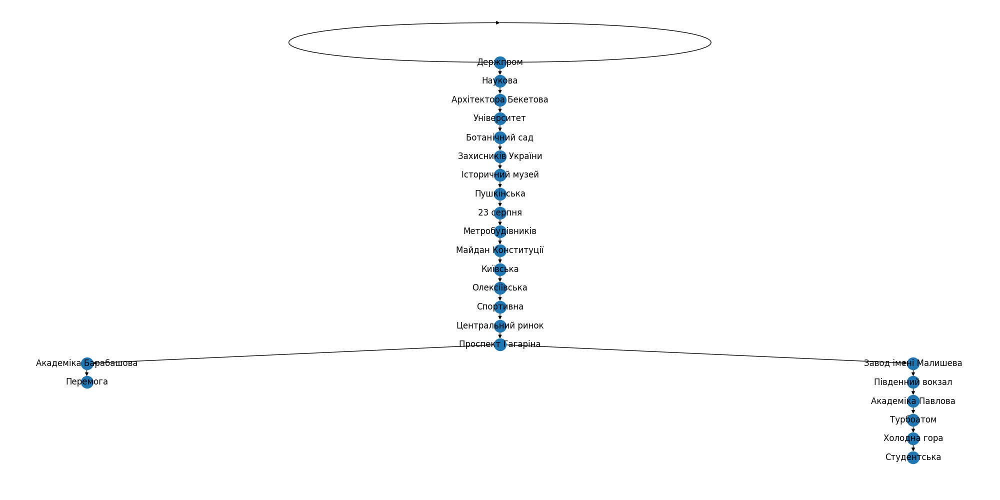
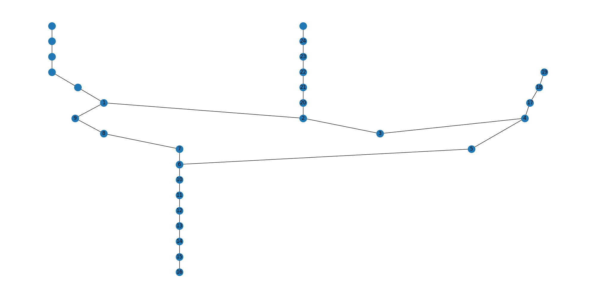
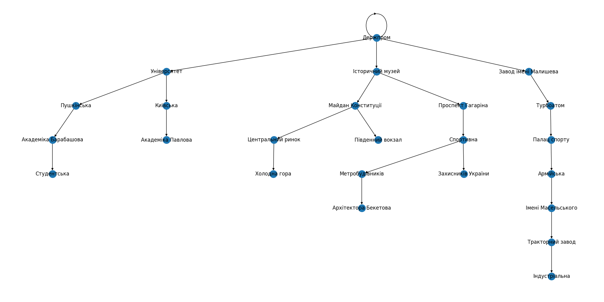
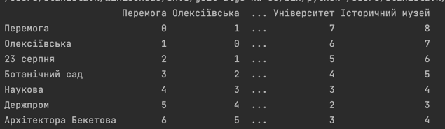

# goit-algo-hw-06
Працювали з графом Харківського метрополітену

Порівнювали роботу алгоритмів пошуку в глибину і ширину (DFS та BFS)
на прикладі пошуку шляху між станціями Держпром і Студентська.

## BFS:

Станція Студентська була знайдена на 24 ітерації. Видно, що вузли проходилися
рівномірно, спочатку перлого порядку від Держпром (сусідні станції), потім
другого порядку, і так далі.

## DFS:

Станція Студентська була знайдена знову-таки на 24 ітерації. Але порядок інший.
Спочатку пішли по "кільцю", потім по кожній "гілці". При чому потрібна гілка
могла бути опрацьована і раніше, якби після 2ої або 9ої ітерації випадковим 
чином була обрана вона. Для ілюстрації - наступний приклад.

## Інший приклад Держпром - Армійська

BFS - 27 ітерацій:

DFS - 13 ітерацій:

## Знаходження найменших відстаней між станціями
Тут звичайні ребра мають відстань 1, а пересадки 2. Для прикладу відстань між станціями
Архітектора Бекетова і Історичний музей. 
Можна піти за часовим колом, а можна проти. в першому випадку цу буде 1+2+1=4, в другому - 
1+1+2+1+1+2=8. Тому алгоритм Дейкстри визначив, що найменша відстань 4.

